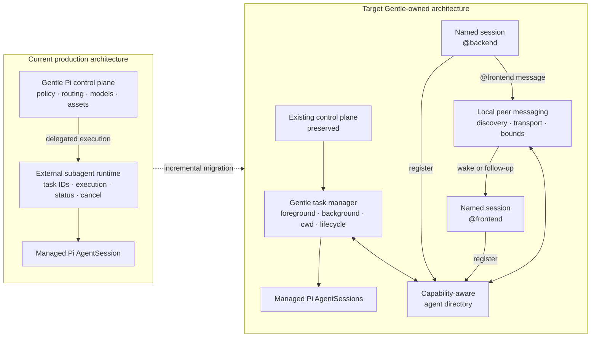
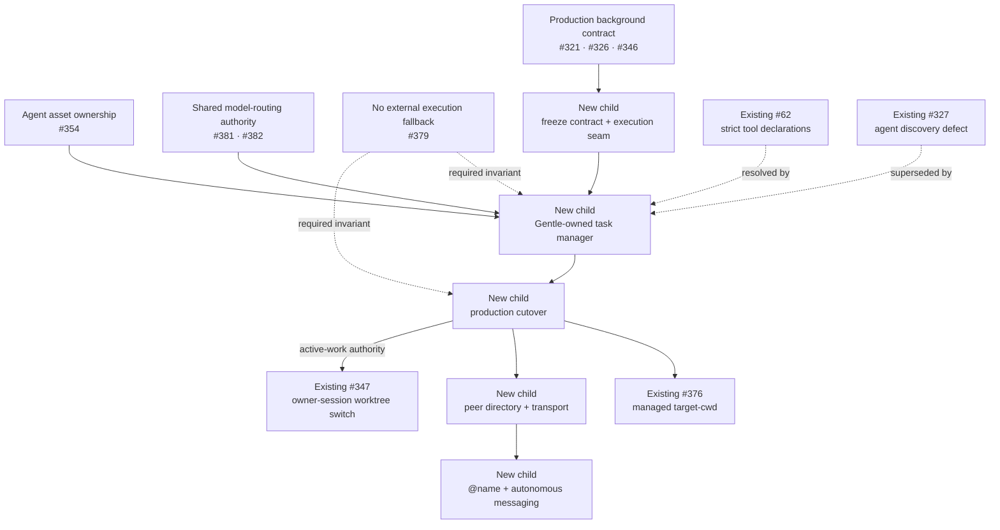

## Outcome

Consolidate Gentle Pi’s existing production agent control plane into a Gentle-owned runtime for managed execution, lifecycle authority, explicit target-cwd work, and named peer messaging between live Pi sessions.

Preserve the background-agent policy, UX, routing rules, model configuration, agent assets, and tests already running in production. Replace only the external execution engine that currently owns task lifecycle.

The final runtime remains inside the existing `gentle-pi` package and requires no third-party subagent runtime.

## Existing production foundation

Gentle Pi already owns and ships:

- the versioned `gentle-pi.background-subagents/v1` policy;
- project → global → environment → default-off resolution;
- `/gentle:background-subagents status|enable|disable`;
- fail-closed malformed configuration handling;
- background eligibility rules;
- a maximum of two parent-level background tasks;
- foreground routing for writers and dependent work;
- completion notifications without polling;
- process-local, non-durable background semantics;
- package-owned Markdown agent assets;
- model and effort routing;
- policy, command, prompt, and integration tests.

Relevant delivered work includes #321, #326, and #346.

This production control plane is retained rather than redesigned.



`backend` and `frontend` are user-selected examples, never fixed product identifiers.

## Current limitation

Gentle Pi can detect whether delegated execution is available, but it cannot authoritatively inspect or control the external runtime’s active tasks.

Consequences:

- #347 cannot safely query active managed work before switching the owner session;
- #376 cannot execute a managed task in an explicit target cwd;
- task identity, status, result, cancellation, and shutdown belong to another runtime;
- independent Pi sessions cannot discover and message one another by human-readable name;
- Gentle Pi depends on an external project’s maintenance and roadmap for core orchestration guarantees.

## Product model

| Entity | Purpose |
| --- | --- |
| Managed agent | A parent-owned foreground or background task with bounded lifecycle, cwd, model, tools, status, result, and cancellation. |
| Named peer session | An independently running Pi session explicitly registered under a human-readable name for direct agent-to-agent messaging. |

Both appear in one capability-aware agent directory. Task supervision and peer transport remain separate responsibilities.

Suggested internal boundaries:

```text
lib/agent-runtime/
lib/agent-messaging/
```

## Managed agent contract

### Agent definitions

Support Markdown agent definitions with:

- name and description;
- system prompt;
- model and effort;
- strict tool allowlist;
- package, global, and project sources;
- deterministic precedence;
- collision reporting;
- actionable validation errors.

Existing Gentle agent assets and configuration migrate without maintaining incompatible formats.

### Execution

Support:

- foreground task mode;
- asynchronous background mode;
- one agent or bounded parallel agents;
- explicit validated cwd;
- runtime-owned task IDs;
- list, status, result, and cancel operations;
- completion notifications;
- parent/task ancestry;
- bounded concurrency;
- deterministic shutdown.

Initial task state machine:

```text
queued → running → completed
                 → failed
                 → cancelled
```

Terminal states are immutable.

### Target cwd

Target-cwd execution remains owned by #376.

The runtime must supply the execution capability #376 requires:

- cwd is an explicit execution property, never a prompt instruction;
- validate the target before task creation;
- load target-project resources through Pi’s normal lifecycle;
- never move tracked, staged, or untracked content;
- pre-creation failure produces no task ID;
- post-creation failure preserves the failed task identity;
- the owner session remains in its original cwd.

### Owner-session worktree switch

Owner-session worktree switching remains owned exclusively by #347.

This runtime contributes only a synchronous active-managed-work projection consumed by #347 before it invokes its own validation, session fork, or runtime replacement.

This tracker does not implement:

- linked-worktree selection or validation;
- `SessionManager.forkFrom()`;
- `ctx.switchSession()`;
- selected-leaf continuity;
- owner-session recovery;
- movement of the active conversation.

## Agent directory

Expose one capability-aware view of live entities known to Gentle Pi.

Each entry contains bounded metadata such as:

- opaque runtime identity;
- human-readable name when present;
- entity type;
- project label;
- task or busy/idle state;
- cwd capability;
- background capability;
- messaging capability;
- cancellation capability;
- parent/task ancestry when applicable.

Credentials, capability tokens, socket paths, and private transport material are never projected.

## Named peer sessions

### Registration

```text
/gentle:peer backend
/gentle:peer frontend
```

Registration atomically:

1. sets the real Pi session display name;
2. publishes a live peer endpoint;
3. rejects duplicate normalized live names;
4. exposes explicit status and disable operations.

Ordinary `/name` remains metadata-only and never enables messaging.

### Human messages

Input beginning with a unique `@peer-name` sends the remaining text verbatim to that peer and does not submit it to the local agent.

`@` autocomplete lists live, uniquely addressable peers with bounded project context.

### Autonomous messages

Registered agents may use:

- `gentle_list_agents`;
- `gentle_send_message`.

No per-message confirmation is required between explicitly registered peers.

Registration grants messaging trust only.

### Delivery

- Messages are UTF-8 plain text.
- Incoming messages are visibly attributed as peer-originated, never human-authored.
- An idle receiver wakes immediately.
- A busy receiver processes the message as a follow-up.
- Each message carries an ID, source, target, protocol version, trace, and hop count.
- Each accepted message triggers at most one receiver turn.
- Deduplication prevents repeated turns.
- Size, rate, queue, and hop limits prevent runaway exchanges.
- Unknown delivery outcomes are not retried automatically.

### Local transport

The live-only first version uses:

- a user-private local registry;
- Unix domain sockets on POSIX;
- equivalently scoped named pipes on Windows;
- random endpoint capabilities;
- heartbeat and liveness validation;
- stale endpoint cleanup;
- clean unregister on shutdown.

No database is required for live-only discovery and delivery.

## Existing issue map



### Existing issues reused

| Issue | Disposition |
| --- | --- |
| #62 | Its strict tool-declaration contract is resolved by the owned manager. Close only when the replacement ships. |
| #63 | Revalidate against currently packaged generic roles before assigning it to this tracker. |
| #327 | Superseded only when owned agent discovery ships. |
| #354 | Input or prerequisite for explicit non-SDD agent-asset ownership. |
| #347 | External consumer of active-work authority; remains owner of session switching. |
| #376 | Existing target-cwd workstream; revise it to consume the owned runtime instead of creating a duplicate child. |
| #379 | Independent no-fallback guard and required invariant. |
| #381 / #382 | Shared model-routing authority consumed by the runtime, never duplicated. |
| #296 | Independent documentation defect. |
| #370 | Independent review/worktree configuration defect. |
| #345 / #346 | Completed production-policy foundation. |
| #134 | Closed and outside this runtime’s scope. |

## New child issues required

### 1. Freeze the production background contract

- Preserve current policy and command behavior.
- Convert production semantics into explicit compatibility tests.
- Introduce an execution-backend seam.
- Keep production routing unchanged.

### 2. Implement the Gentle-owned task manager

- Agent definition resolution.
- Pi session construction.
- Task state machine.
- Foreground and background execution.
- Status, result, list, and cancellation.
- Concurrency, ancestry, notifications, shutdown, and active-work projection.

### 3. Add named peer directory and transport

- `/gentle:peer <name>`;
- live registry;
- Unix socket and Windows named-pipe adapters;
- authentication, liveness, deduplication, bounds, and cleanup.

### 4. Add peer UX and autonomous messaging

- `gentle_list_agents`;
- `gentle_send_message`;
- `@peer-name` autocomplete;
- exact human-send syntax;
- always-wake delivery;
- trace and anti-loop controls.

### 5. Migrate production and remove external coupling

- Atomically switch Gentle orchestration.
- Replace external capability probes with owned runtime state.
- Remove external-provider documentation and required installation.
- Verify packed Gentle Pi without another subagent runtime.
- Preserve the production background policy and behavior.

## Migration invariants

- No dual execution.
- No fallback to the previous execution provider.
- No third-party source reuse.
- No production cutover before parity, failure, shutdown, and packed-install tests pass.
- A failed replacement candidate leaves production routing unchanged.
- Every cutover or migration step is independently reviewable and reversible.

## Implementation provenance

The owned runtime is independently authored from:

- Gentle Pi’s existing product contract and production tests;
- Pi’s public SDK and extension documentation;
- newly authored Gentle-specific requirements and acceptance tests.

Implementation work must not copy or derive third-party source, tests, comments, documentation text, error strings, fixtures, or internal structure.

Any future proposal to import external material requires a separate explicit licensing and provenance decision before implementation.

## Safety boundaries

- Existing background policy remains explicit, user-owned, and off by default.
- Tool allowlists fail closed and never broaden silently.
- Peer messages cannot approve permissions or consent.
- Peer messages cannot execute slash commands or expand templates.
- Peer content cannot impersonate a human message.
- Tasks and messages never transfer files, transcripts, secrets, or dirty content implicitly.
- Managed-task and peer-message queues are bounded.
- Missing capabilities fail before task creation.
- Peers, panes, terminals, or external runtimes never become managed-execution fallbacks.
- Messaging is not a sandbox against a malicious process already running as the same OS user.

## Review workload

- Keep each child PR at or below 400 changed lines unless a maintainer explicitly grants `size:exception`.
- Keep each PR reviewable in approximately 60 minutes or less.
- Split by deliverable behavior, never by file type.
- Keep tests and documentation with the behavior they verify.
- State dependencies, follow-up work, rollback scope, and out-of-scope items in every child PR.
- Use stacked-to-main delivery when a slice can land independently.
- Use a feature-branch chain when partial integration must remain isolated.

## Tracker acceptance criteria

- [ ] Existing production policy, UX, eligibility, limits, and notification behavior remain covered and unchanged unless separately approved.
- [ ] Gentle Pi owns managed task identity and lifecycle.
- [ ] Agent definitions support strict model, effort, and tool declarations.
- [ ] Foreground and background execution work without an external subagent runtime.
- [ ] Status, result, list, cancel, concurrency, ancestry, notifications, shutdown, and active-work projection are deterministic.
- [ ] Existing background policy remains user-owned and off by default.
- [ ] #347 consumes active-work authority without moving worktree-switch ownership into this tracker.
- [ ] #376 consumes the owned target-cwd runtime.
- [ ] Sessions can register arbitrary human-readable peer names.
- [ ] Registered peers can discover and message each other across projects.
- [ ] Incoming peer messages wake idle recipients and follow up after busy work.
- [ ] Autonomous messaging cannot grant permissions, impersonate users, execute commands, or loop without bounds.
- [ ] Gentle-managed execution has no required third-party runtime.
- [ ] No copied or derived third-party source is included.
- [ ] Packed-install tests prove the owned runtime works independently.
- [ ] Existing issues are reused or explicitly dispositioned rather than duplicated.
- [ ] Delivery uses approved child issues and reviewable work-unit PRs.

## Initial non-goals

- Owner-session worktree switching, owned exclusively by #347.
- Copying, vendoring, or forking another subagent runtime.
- A generic adapter framework for third-party runtimes.
- Durable task history across Pi restarts.
- Task continuation or resume.
- A dedicated agent-dashboard TUI.
- Cross-machine discovery or messaging.
- Offline mailboxes or message history.
- Slack-like channels, rooms, broadcasts, or shared timelines.
- Shared agent-team task lists.
- Moving or merging Pi sessions.
- Moving dirty filesystem content.
- A separate Gentle runtime package.

